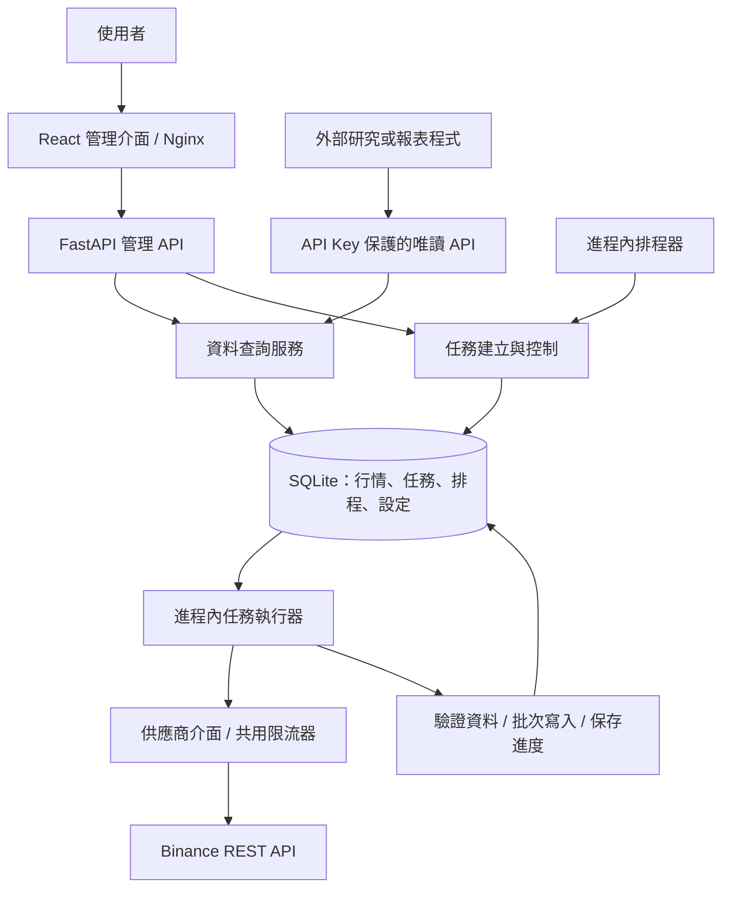

# TradeBridge 整體架構與未來方向

檢視日期：2026-09-19。本文依目前原始碼、README 與任務可靠性決策文件整理；屬靜態架構檢視，未在本次執行測試或實際交易所連線。未來方向為建議，不代表已核定的開發承諾。

2.0.0 部署更新：整站加入可設定的 `APP_BASE_PATH`（預設 `/tradebridge`）。Nginx 與前端使用相同前綴，後端透過 FastAPI `root_path` 對應內部 `/api/v1` 路由；公開入口僅限專案前綴；未加前綴的舊 API、文件與根目錄不再代理或轉址。後端內部路由不代表對外入口，後端連接埠不對外發布。外層代理保留完整路徑、公開 Host 與協定資訊，僅接受保護的 8081；8080 保留本機操作，Nginx 以私有密鑰驗證免登入來源。管理 API 與文件由後端 middleware 統一保護，session／限流位於單進程記憶體，重啟撤銷。變更前綴需重建前端；操作與映射範例見根目錄 README。

## 1. 專案定位

TradeBridge 目前是一套本機部署的行情 K 線資料管理工具，支援 Binance 現貨資料，核心工作是收集、保存、檢查與修補行情，並提供管理介面及外部唯讀 API。

它已具備資料平台的基礎：市場管理、歷史回補、增量同步、缺口管理、排程、可恢復的背景任務與資料查詢。目前原始碼未見策略引擎、回測引擎、委託下單、持倉或交易風控模組，因此不宜把它描述成已完成的自動交易系統。

建議的長期定位是：**把交易所行情轉成可靠、可追溯、可重複使用的資料，供研究、回測、報表與策略系統使用。**

## 2. 整體架構

目前採前後端分離、後端模組化單體的架構。Docker 有前端與後端兩個服務；排程與任務執行器仍在同一個後端進程內。



### 技術與部署

| 區域 | 現有實作 | 責任 |
| --- | --- | --- |
| 前端 | React 19、TypeScript、Vite、Ant Design | 儀表板、資料檢視、任務操作、系統設定 |
| API | Python 3.11+、FastAPI、Pydantic 請求與回應模型 | 接收操作、驗證輸入、提供查詢與控制介面 |
| 應用服務 | Python services 與 ports | 抓取計畫、任務流程、排程規則、缺口與市場管理 |
| 領域模型 | Candle、MarketPair、CandleInterval、Provider | 表達行情資料及基本規則 |
| 外部整合 | httpx、Binance client、Provider registry、limiter | 取得行情、市場探索、供應商連線及限流 |
| 儲存 | SQLite、WAL、Repository | 行情、任務進度、排程、設定及 API Key 記錄 |
| 背景處理 | ScheduleRunner、JobRunner | 到期任務入列、派工、恢復與停止 |
| 部署 | Docker Compose、Nginx、單一 Uvicorn worker | 同源介面、API 代理與持久化資料卷 |

### 後端分層

```text
backend/src/app/
├── main.py                  啟動、資料庫初始化、背景服務生命週期
├── api/v1/                  路由、依賴組裝與 API 入口
├── schemas/                 請求與回應格式
├── application/
│   ├── services/            使用案例與流程協調
│   ├── ports/               資料庫、供應商、任務執行介面
│   └── models/              應用層資料模型
├── domain/                  K 線實體與值物件
├── infrastructure/
│   ├── external/            Binance 與供應商限流
│   ├── persistence/         SQLite 實作與升級
│   └── scheduler/           排程器與執行器
└── core/                    設定與日誌
```

核心應用服務透過 ports 使用外部能力，SQLite 與 Binance 提供具體實作，`api/v1/dependencies.py` 負責組裝。這種結構接近 ports/adapters 架構，讓供應商與儲存實作具有替換空間；但部分設定 API 直接操作 Repository，並非所有路徑都經過應用服務。

### 前端結構

前端以四個主要頁面組成：Dashboard、Data、Jobs、Settings，另有共用 API client、行情 API/types、圖表與覆蓋率元件，以及繁體中文與英文文字資源。

目前透過 React state 切換頁面，未使用 URL 路由。主要頁面已串接 API；仍有個別元件保留模擬資料預設值，例如 CoveragePanel，但不能因此認定整個儀表板使用假資料。頂部 API 狀態標籤目前是固定呈現，應與實際健康狀態區分。

## 3. 核心資料流程

1. 使用者手動抓取、修補缺口，或由排程建立任務。
2. 後端將任務持久化至 SQLite；抓取 API 回傳 202 與任務資訊，前端輪詢進度。
3. 任務執行器取得可執行任務。預設最多同時處理兩個不同市場；同一市場的不同 K 線週期依序執行。
4. 抓取計畫依模式決定區間，包括最新資料、歷史回補、補缺口、覆寫指定區間或刪除後重載。
5. Binance client 經共用限流機制分批讀取行情，處理可重試的連線及供應商錯誤。
6. 每一批將 K 線、處理游標、計數與批次憑證放在同一交易提交，避免資料已寫入而進度未更新。
7. 檢查資料連續性並更新任務結果；使用者與外部程式透過查詢 API 讀取資料。

K 線保留 OHLC、成交量、交易筆數、時間與原始供應商 payload。資料唯一性由供應商、市場類型、交易所代碼、週期與開盤時間共同決定，為重複抓取與覆寫提供基礎。

### 目前架構的強項

- 任務先存檔再執行，具有暫停、恢復、取消與重啟接續機制。
- 租約、心跳與執行 token 限制失效 worker 繼續寫入。
- 請求支援冪等鍵，排程觸發有紀錄，降低重複建立任務的風險。
- 刪除重載會先取得並驗證一批資料，再於交易中替換該批，避免先清空整段歷史。
- 已有服務、API、Repository 與任務中斷恢復相關測試；本次僅確認測試存在，未宣稱全部通過。

這些設計顯示，現有工作的重心已從「取得資料」進入「可靠地持續管理資料」。

## 4. 已完成、預留與限制

| 項目 | 現況判讀 |
| --- | --- |
| Binance 現貨 K 線 | 已有供應商與市場管理實作 |
| 多交易所 | 已有 provider 介面與 registry；目前型別與建立邏輯仍只接受 Binance |
| 期貨等市場 | 有 market_type 欄位，但多處驗證與流程限定 spot，尚非完整多市場支援 |
| 任務可靠性 | 已有持久化、控制、恢復、限流與批次一致性設計 |
| 外部資料供應 | 已有受 API Key 保護的市場、K 線、覆蓋率與缺口唯讀端點 |
| 通知 | 已有設定介面與儲存；本次未見事件判定、發送器與寄信流程 |
| 備份 | 資料重設流程有可選備份；未見完整定期備份及還原演練流程 |
| 管理端登入 | 2.0.0 提供 env 單一帳密及 12 小時記憶體 session；8080 本機免登入、8081 對外代理需登入，外部 API 另驗 Key |
| 水平擴充 | 現有設計要求單一後端進程／容器，不能直接增加副本 |
| 策略、回測與下單 | 目前未見對應引擎與業務模組 |

主要維護壓力集中於大型前端頁面：Data、Jobs、Settings 各約兩千行，介面、請求、狀態與互動邏輯較集中。未來增加功能前，適合按責任拆成元件與 hooks。SQLite 目前符合本機工具定位；是否更換資料庫，應由資料量、查詢延遲與寫入競爭的測量決定。

## 5. 建議未來目標

以下是由目前實作推導的發展路線；現有文件中未找到完整產品 roadmap。

### 階段一：成為可以長期運行的資料管理工具

目標是讓使用者清楚知道資料是否完整、任務是否正常，以及出錯後如何恢復。

- 完成通知事件、發送管道、限流與通知歷史，讓現有設定真正生效。
- 增加定期備份、保留策略與可驗證的還原操作。
- 讓頂部連線狀態與健康 API 一致，清楚區分載入、失敗、無資料與正常狀態。
- 拆分大型前端頁面，對建立任務、暫停恢復、缺口修補等核心使用流程加入端到端驗證。
- 若要開放遠端或多人使用，先補上管理端身分驗證、權限與操作紀錄。

驗收方向：中斷後可接續、缺口可追蹤、異常可通知、備份可還原，介面呈現可對應後端實際狀態。

### 階段二：成為其他程式可以依賴的行情資料中心

目標是讓研究、報表與回測程式共用同一份可靠行情。

- 完善外部 API 文件、錯誤格式、分頁與版本相容性規則，提供實際呼叫範例。
- 加入 CSV／Parquet 等資料匯出，以及包含市場、期間、時區與缺口摘要的資料集描述。
- 增加資料新鮮度、覆蓋率、缺口修復耗時等品質指標。
- 以第二個供應商驗證既有抽象：同步調整 provider 型別、設定、前端選項、限流與測試。
- 擴充其他市場前，先統一市場識別、查詢條件及各市場特有欄位，避免僅新增 market_type 值。

驗收方向：外部程式不必直接讀 SQLite；同一查詢可取得格式一致且品質資訊清楚的資料。

### 階段三：依需求支援更大規模與更即時的資料

此階段應由量測結果驅動，避免提早引入額外維運成本。

- 當 API 回應與大量任務互相影響時，考慮將 API、排程器與 worker 拆成獨立程序。
- 拆分前先處理跨程序限流、維護鎖、任務領取與排程協調，保留現有冪等與批次一致性保證。
- 當 SQLite 出現可重現的瓶頸，再評估集中式資料庫與歷史資料歸檔；不預先指定遷移產品。
- 若產品需要即時行情，再加入 WebSocket 收集與斷線補回機制，明確區分未收盤與已收盤 K 線。

驗收方向：擴容後不重複派工、不丟失進度，並以壓力測試證明吞吐或延遲改善。

### 遠期選項：研究與策略生態

可以讓獨立的指標計算、回測與策略系統透過資料 API 使用 TradeBridge。若未來確定要涵蓋實盤交易，需另行設計委託生命週期、帳戶、持倉、對帳與風控邊界；這是新的產品範圍，不能視為現有抓取任務的直接延伸。

## 6. 架構選項與建議

| 選項 | 適用情況 | 取捨 |
| --- | --- | --- |
| 維持模組化單體、逐步整理 | 目前本機與小規模使用 | 部署簡單、變更成本低；保留單進程限制 |
| API 與背景 worker 分離 | 長任務影響介面、多使用者或持續擴大資料量 | 可獨立調整執行能力；需新增跨程序協調 |
| 拆成多個獨立服務 | 多團隊、不同服務需獨立發布且需求已明確 | 隔離與擴展彈性高；維運與一致性成本最高 |

現階段建議採第一種：保留既有分層與可靠任務核心，先補完操作體驗、通知、備份和外部資料契約，再用實際負載判斷是否分離 worker。

具體執行順序可採「狀態呈現與頁面整理 → 通知與備份 → 外部 API 與匯出 → 第二供應商 → 容量評估」。每一步獨立驗收；前端拆分以維持行為為原則，資料庫變更保留升級前備份，worker 分離則須先通過原有中斷恢復與一致性測試。

## 7. 主要依據

- [專案說明](../README.md)：產品定位、部署與單進程限制。
- [任務可靠性決策](decisions/task-reliability.md)：任務狀態、租約、批次提交、恢復與升級。
- [後端入口](../backend/src/app/main.py)：啟動、排程器與執行器生命週期。
- [依賴組裝](../backend/src/app/api/v1/dependencies.py)：服務、ports 與基礎設施的接線。
- [供應商 registry](../backend/src/app/infrastructure/external/provider_registry.py)：供應商建立與共用限流。
- [外部唯讀 API](../backend/src/app/api/v1/routes/external.py)：對外資料契約與 API Key 驗證。
- [通知 API](../backend/src/app/api/v1/routes/notifications.py)：目前通知設定功能的範圍。
- [前端版面入口](../frontend/src/app/layout/AppLayout.tsx)：主要頁面及頂部狀態呈現。
