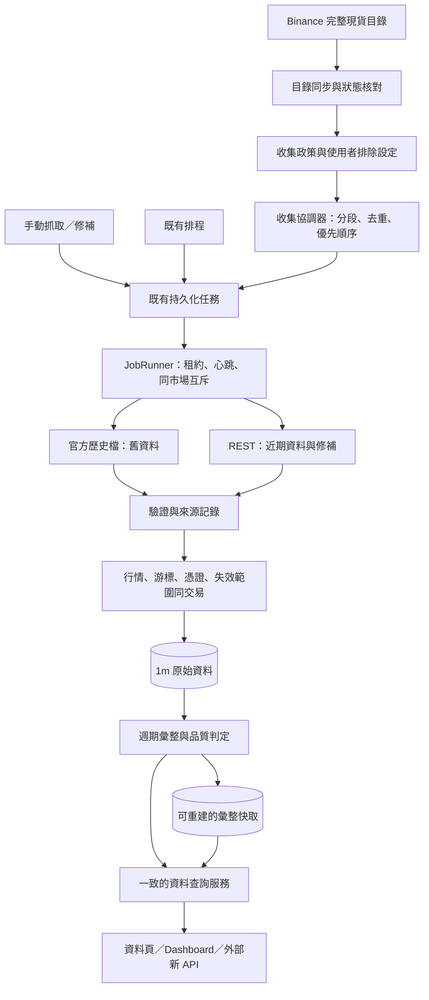

# 1. 概覽

本規劃保留 2026-09-20 以產品 1.1.1、Git 提交 `ab34599` 為基準的設計及驗收方向。使用者於 2026-09-21 授權建立目標並實作；目前交付契約、設計取捨與驗證結果見 [實作紀錄](minute-data-implementation.md)。以下草稿中的表名、分期版本與待確認描述不代表目前產品狀態。

## 1.1 已確認需求

| 項目 | 已確認方向 |
| --- | --- |
| 來源 | Binance 現貨 |
| 市場 | 全部交易對，不限 USDT 報價；BTC/USDT、BTC/USDC、ETH/BTC 分別保存 |
| 原始週期 | 只以 1 分鐘 K 線作為新收集模式的基礎 |
| 歷史 | 每個交易對從供應商最早可取得資料開始，回補到現在 |
| 後續 | 自動追蹤新交易對並更新資料 |
| 衍生週期 | 由 1 分鐘彙整較大週期 |
| 整合 | 與現有市場管理、抓取、任務、排程、缺口、查詢及外部 API 一起設計 |

## 1.2 建議預設與邊界

下列為規劃建議，尚未由使用者逐項指定；實作時以具體設定呈現，不把建議寫成既成授權。

- 「全部」先解釋為啟用時目前可交易的現貨交易對，加上之後新上架者。目錄同時保存可觀測到的暫停狀態。啟用前就已下架、只留在歷史檔案中的交易對，另設歷史目錄探索範圍，不能宣稱目前清單涵蓋所有曾存在的市場。
- 升級後自動收集預設關閉；使用者在介面啟用。單純儲存設定或同步目錄不下載多年行情。
- 市場清單每 6 小時同步一次，可手動同步；短暫消失至少經兩次成功完整快照確認，仍標成「未再觀測到」，不直接等同已下架。
- 保存已收盤分鐘線；較大週期可顯示進行中結果，但必須清楚標示。畫面時區沿用偏好，K 線分桶固定 UTC。
- 全市場最新資料先以 15 分鐘內更新為試行目標，依市場數、延遲及限流實測調整；不是服務保證，也不是把 K 線改成 15 分鐘。
- 手動停用、手動暫停與取消不得被下一輪自動收集覆蓋。停止交易後保存所有已收資料。
- 維持單一後端進程、最多兩個不同市場執行；不以此需求直接引入微服務、Redis、Kafka 或更換資料庫。

## 1.3 本次明確不承諾

1 分鐘資料無法還原 1 秒 K 線或逐筆成交。期貨、下單、策略、回測、通知發送、完整備份產品介面不是此需求範圍。無法保證供應商仍提供每個曾存在市場的全部歷史；不可把「API 空回應」或「下載任務完成」等同資料完全無缺。

# 2. 系統架構

## 2.1 程式查閱結果

| 已有能力／限制 | 證據與設計影響 |
| --- | --- |
| 市場探索已存在 | `infrastructure/external/binance_client.py` 的 `discover_markets` 呼叫 exchangeInfo，但限定 TRADING 且以 limit 截斷；不能直接當生命週期的完整目錄 |
| 探索介面偏向手選 | `api/v1/routes/providers.py` 預設 USDT、50 筆、最多 500；`SettingsPage.tsx` 目前以 USDT、200 筆探索。全市場同步需独立的完整快照流程 |
| 可查最早資料 | client 的 `first_available_open_time_ms` 及 job service 的 `_resolve_provider_start_open_time_ms` 可沿用，但需保存來源與查核範圍 |
| 可靠任務已存在 | JobRunner、execution store 有同市場互斥、租約、心跳、token、批次交易與重啟恢復；新流程必須經同一機制 |
| 派工目前依入列時間 | `sqlite_job_execution_store.py::claim` 依 queued_at_ms、id；只加入更多長任務會阻擋近期更新 |
| 缺口檢查會載入整段時間 | CandleService 及 job service 把開盤時間讀成 set，再逐格檢查；多年分鐘線需要分段或串流版本 |
| SQLite 每筆不只 OHLCV | candles 保存時間字串、原始 payload、時間戳與多個索引；容量不能只用 CSV 大小估算 |
| 查詢主要直接讀指定週期 | CandleService / SQLiteCandleRepository 未提供分钟線彙整；新增統一查詢服務 |
| 週期邊界有相容性問題 | CandleInterval 以 epoch 取模；1M 明確拒絕，1w/3d 的原點需對照供應商驗證，不能原樣套入新彙整 |
| 外部 API 回傳原始 payload | `external.py` 使用 CandleResponse，包含必要的 raw_payload_json 字串；不可偽造彙整結果的供應商 payload |
| 舊程式會拒絕較新 schema | `job_migrations.py` 拒絕 schema version > 1；未來新增 migration 後不能只 revert 程式當資料回復 |

這些是靜態程式查閱結果；本次沒有實測全市場數量、完整歷史量、匯入速度或 SQLite 容量上限。

## 2.2 建議流程

協調器只決定下一段應該做什麼，不自行抓行情或寫 K 線；REST 與檔案匯入都由受 token 保護的任務執行。歷史檔仍屬 Binance 來源，不新增假的交易所 provider。

# 3. 功能規格

## 3.1 自動市場目錄

### 3.1.1 功能描述

同步目前可觀測的完整現貨目錄，保存交易所狀態與觀測時間；將應收集的市場以唯一鍵加入現有市場管理。

### 3.1.2 功能用法

設定 → 市場管理可預覽全部報價資產，查看新增／狀態改變／未再觀測到的交易對，再由自動收集政策決定是否抓取。手動新增功能保留。

### 3.1.3 介面／元件命名規範

全系統以 `(provider, market_type, exchange_symbol)` 識別市場，不以畫面名稱拆字推算。畫面分開呈現「交易所狀態」「收集設定」「資料進度」；不要把三者壓成一個 enabled。

### 3.1.4 業務規則與限制

- 完整取回並驗證格式後才發佈快照；解析錯誤、網路失敗或明顯異常縮減不觸發大量停用。
- 查核現貨資格與狀態，不因 symbol 存在就認定可交易；原始 status 與現貨資格分開保存。
- 新交易對只加入一次；與既有手動市場匹配時沿用 ID、預設市場與使用者停用狀態。
- 明示 HALT/BREAK 時暫停增量派工；缺席清單先記 unknown／未再觀測到。恢復 TRADING 且使用者未停用才續抓。
- 已排隊任務在 claim 前再檢查狀態；正在執行者於安全邊界停下，保留已提交資料。生命週期變更不直接刪除 K 線。
- 復牌從既有缺口及游標銜接；symbol 更名或資產重命名不自動合併歷史，保留明確關聯待處理。

## 3.2 全歷史分鐘資料收集

### 3.2.1 功能描述

為每個納管市場建立可持續的收集狀態，從最早可驗證的分鐘線開始分段回補，同時更新近期資料。

### 3.2.2 功能用法

任務頁 → 自動收集：預覽市場數、已有資料與衝突排程；啟用後可查看全體進度、暫停歷史回補、暫停全部收集、排除市場及重試指定失敗段。

### 3.2.3 介面／元件命名規範

「歷史回補」表示固定歷史區間的覆蓋；「近期更新」表示最新已收盤資料的新鮮度；「已掃描」與「資料完整」分開。所有時間範圍內部採 `[start, end)`，轉成 REST endTime 時才扣 1 ms。

### 3.2.4 業務規則與限制

- 最早點採每市場實際回應／有效歷史檔，不統一假設所有幣在某年上市。找不到資料記為等待或無可用歷史，不能顯示回補完成。
- 初次建立時固定歷史截止點 T0。先提供最近 24 小時的可用分鐘資料，再將更早部分從源頭向後補；歷史仍補全，不縮短使用者要求的範圍。
- 歷史游標與近期連續游標分開。某一筆最新資料存在，不代表其之前全部完整；不得用 MAX(open_time_ms) 跳過中間缺口。
- 現有 worker 同市場互斥、批次交易、execution token 與所有控制語意保留。
- 歷史任務切成有限區段，按市場輪替；待執行子任務有總量上限，不一次建立數百萬筆任務。
- 暫停／取消有持久化原因；自動協調器不得立即補建被使用者停下的工作。取消本次回補後需明確「重新納入」才再建立。
- 遇限流共享等待；重試有退避、次數與 next_retry_at，不讓單一失敗市場卡住全體。
- 使用者已有資料也適用：跳過已驗證覆蓋段，僅補缺口；不能以清空資料庫為上線前提。

## 3.3 週期彙整與品質

### 3.3.1 功能描述

由 1m 產生較大週期的 OHLCV 及交易筆數，並附來源、完成狀態、分鐘覆蓋與缺口資訊。圖表、表格、統計、覆蓋率與外部新 API 共用此邏輯。

### 3.3.2 功能用法

資料頁保留週期選單；選 1h 時自動顯示由分鐘線組成的小時線。明確顯示「1m 原始」「1m 彙整」「既有原生週期」資料來源。缺失可點選修補其分鐘區間。

### 3.3.3 介面／元件命名規範

以 `is_closed` 表示時間已結束，以 `is_complete` 表示來源資料齊全；兩者獨立。`origin` 為 provider／aggregated；原始下載通道另記 REST／archive。

### 3.3.4 業務規則與限制

| 欄位 | 規則 |
| --- | --- |
| open／close | 該桶第一／最後一筆有效分钟線的開／收盤價 |
| high／low | 有效分鐘線最高／最低價 |
| base_volume、quote_volume、taker_buy 兩種 volume | 精確十進位加總 |
| trade_count | 整數加總 |
| 完整性 | 檢查唯一分鐘時間、桶邊界及预期格數，不能只計陣列長度 |
| 空桶 | 無 OHLC，回傳缺口資訊；不造零價或以前收盤價補成真實行情 |

- 3m、5m、15m、30m、1h、2h、4h、6h、8h、12h、1d 先落地；1w、3d 必須通過 Binance UTC 邊界樣本驗證後提供。1M 需新增日曆算法，包含月底及閏年，納入完整彙整交付，不用固定 30 天替代。
- 1s 不在此模式提供，舊有 1s 原始資料仍可讀。不得假稱可由 1m 推導。
- 計算使用 Decimal 與足夠精度，不用 float 或 SQLite REAL 加總金融小數。
- 新上市第一個不滿整桶的區間、暫停交易期間、分鐘缺漏及進行中的桶各有原因。可顯示觀測值，但不能標為標準完整桶。
- 預設新 API 回傳已收盤且完整的桶並附排除摘要；畫面可選擇顯示不完整／進行中的桶。進行中結果只含已收到的分鐘，不冒充即時完整資料。
- 任何分鐘回補、覆寫、delete_reload 或清除，都需使受影響彙整快取失效。

## 3.4 既有功能銜接與操作控制

### 3.4.1 功能描述

讓新收集模式可與舊資料及 API 共存，並在啟用時處理重複排程。使用者能知道系統在做什麼、為何等待，以及如何停止。

### 3.4.2 功能用法

首次啟用顯示遷移預覽：即將纳管的交易對、手動停用市場、重疊的 1m 排程及非 1m 原生抓取排程。選擇停用或保留特定舊排程後，才套用新政策。

### 3.4.3 介面／元件命名規範

「自動收集政策」獨立於「手動排程」；「暫停歷史」「暫停全部」「停止納管」須有不同文案。狀態、數字與錯誤均由 API 提供，不加模擬完成百分比。

### 3.4.4 業務規則與限制

- 新模式及其一般手動補抓只下載 1m；較大週期操作轉成對應分鐘區間，再重新彙整。
- 既有原生週期資料不刪、不混寫、不自動冒充彙整資料。舊 API 保留讀取與既有明示操作能力；新 UI 不再建立非 1m 自動收集任務。
- 既有排程不能靜默改 interval。啟用預覽建議暫停重疊與非 1m 排程並保存原設定；選擇保留者標為相容模式，揭露仍會重複下載。
- 暫停歷史不停止近期更新；暫停全部需讓既有執行批次安全落盤後停止。
- 磁碟不足由系統阻止新寫入派工，保留讀取；清理的是可重建暫存與快取，不自動刪原始資料。
- SCHEDULER_ENABLED=false 應同時抑制新政策的自動派工；既有人工任務與故障恢復契約不變。
- 清除市場資料前停下政策，清除後保留政策為暫停狀態，避免剛清完就全量重抓。清除任務歷史不得留下失效的 segment/job 引用；仍拒絕清除未完成任務。

# 4. 技術詳細設計

所有新增名稱、欄位及端點皆為提案；實作前核定 DTO 細節。API 路徑下文省略 APP_BASE_PATH，部署時仍為 `/tradebridge/api/v1/...`，前端不可硬編碼專案名。

## 4.1 自動市場目錄技術實作

### 4.1.1 資料庫設計

新增 `market_catalog`，唯一鍵為 provider／market_type／exchange_symbol，保存 base、quote、原始 status、現貨資格、first_seen、last_seen、last_snapshot_id、missing_since 及觀測狀態。以完整市場身份映射既有 markets，保留 markets.enabled 的使用者意圖。

新增 `catalog_sync_runs` 保存 running／success／failed、開始結束時間、完整性、總量、增減量、來源摘要與錯誤；避免對每次畫面查詢重新向 Binance 取完整清單。異常快照暫存，驗證成功後一次發布；控制快照保存數量。

### 4.1.2 程式處理邏輯

擴充 provider port 為「完整目錄快照」能力；現有搜尋／limit 探索 API 保持原用途。取回未限 TRADING 的現貨目錄，驗證 symbol/base/quote、重複值與狀態；單筆不合法或目錄突變要可見，不悄悄當完整資料。

來源提供 exchangeInfo 及現貨、交易狀態欄位，可據此設計資格檢查；交易所缺席狀態仍需本地多次觀測判斷。[Binance 官方 exchangeInfo](https://developers.binance.com/en/docs/catalog/core-trading-spot-trading/api/rest-api/general)

網路在交易之外；短交易發布快照與市場更新。同步本身有持久化執行紀錄、單一執行控制及崩潰恢復；長工作不靠 HTTP request 存活。

### 4.1.3 API 規格

| 提案端點 | 契約 |
| --- | --- |
| POST /api/v1/market-catalog/sync | 202 + sync_id；支援 Idempotency-Key；不觸發行情回補 |
| GET /api/v1/market-catalog/syncs/{id} | 狀態、增減量、來源與錯誤 |
| GET /api/v1/market-catalog | 搜尋、報價資產、交易所狀態及游標分頁，不默認 USDT |

不支援的來源／市場回 400；冪等鍵內容冲突回 409；維護中回 503。外部不可存取同步修改端點。

## 4.2 全歷史分鐘資料收集技術實作

### 4.2.1 資料庫設計

| 提案結構 | 職責 |
| --- | --- |
| collection_policies | 單一 Binance spot 政策、enabled、固定 1m、同步目標、排除規則、queue 上限與修訂號 |
| collection_states | 每市場最早可得點、發現來源、歷史 cutoff／next_start、近期連續點、最近驗證時間、控制原因、重試時間 |
| collection_segments | 固定區段與用途、政策修訂、job_id、結果；區段唯一鍵防重複，不能以每次重試的新 UUID 規避去重 |
| archive_imports | 檔案 URI、年月日、CHECKSUM、來源時間單位、匯入批次進度與驗證結果 |
| 既有 fetch_jobs 的小幅擴充 | collection 關聯、用途／優先級、not_before；保留原狀態機與 token |

政策修訂用於核對設定，不應讓同一市場／用途／區間的存活任務因修訂號不同而重複。重試沿用原任務或具有明確替代關係；segment 的完成必須可追溯 job 批次憑證。

### 4.2.2 程式處理邏輯

1. 由目錄挑選納管市場，逐步探測最早資料；最早時間、來源與查核時間持久化。
2. 固定 T0 與已收盤分鐘邊界，歷史及近期建立獨立範圍；持久化 segment 與 job 連結，遵守既有建立冪等與排程去重機制。
3. 首先建小型近期任務，再讓歷史分段前進；每市場最多一個可執行歷史段，加一個合併後的近期待辦。queue 暫定上限 100，超過只保留協調器狀態，分批補入。
4. 舊完整月份優先使用官方歷史檔，已發布的近期日檔銜接，REST 補當前尾端與缺口。月／日檔發布不是瞬時，檔案缺失需重查或回退 REST，不能視為市場無資料。
5. 檔案驗 CHECKSUM，再以有限記憶體分批解析；原始列及来源單位可追溯，內部時間統一毫秒。不能直接對所有日期都乘除同一倍率。
6. 既有 REST 批次寫入與新檔案批次匯入共用 fenced batch commit。行情、游標、批次憑證、相關狀態與快取失效範圍同交易；段完成以已提交證據確認。網路及下載在交易外。
7. 每段有時間／批次数上限；REST 暫定最多 10,000 根約 7 日，檔案即使是一個月也要有可持久化的解析游標及安全讓出點，不能整月一個巨大交易。讓出排回 pending，不偽裝成使用者 paused。
8. 近期更新有最低份額，歷史亦有公平份額；以加權輪替配合等待時間提升優先級，不能單用嚴格高優先級造成歷史永不執行。同市場仍不並行。
9. 未完成長工作重啟依 saved plan／cursor 繼續，重試去重；錯誤只影響相應市場或來源，供應商 429/418 cooldown 對共用呼叫者生效。
10. 缺口檢查改成有序 keyset 分頁／串流比較相鄰開盤時間，持久化區段覆蓋摘要；不反覆把數年每分鐘時間載進 Python set。

官方歷史資料提供日／月檔與校驗檔，且現貨自 2025-01-01 起檔案時間戳使用微秒；檔案也可能被官方修正。因此 importer 需保存來源、checksum 與格式版本，檔案變更時可重匯並使彙整失效。[Binance 官方歷史資料說明](https://github.com/binance/binance-public-data)

REST 單次 K 線最多 1,000 筆、請求權重為 2；只靠 REST 做全市場多年分鐘回補會產生大量請求，因此檔案匯入是此規模下的建議方案，不是現有能力。[Binance 官方 K 線 API](https://developers.binance.com/en/docs/catalog/core-trading-spot-trading/api/rest-api/market)

來源碰撞需有規則：同一分鐘 REST／archive 值相同則冪等；值不同記錄差異與來源修訂，不以最後一次 HTTP 回應盲目覆蓋。已驗證的官方歷史修訂可按明確重匯操作取代；近期區間以 REST 為主。原始 provider payload 保留，archive 原始列／checksum 另有來源記錄。

### 4.2.3 API 規格

| 提案端點 | 契約 |
| --- | --- |
| GET/PATCH /api/v1/collection/policy | 讀取／儲存配置；revision 控制避免覆蓋新設定，儲存不等於啟用 |
| POST /api/v1/collection/preview | 回傳納管數、衝突排程、容量估算與未知項；耗時探測以 202 可輪詢工作處理 |
| POST /api/v1/collection/start | 採用指定 revision，202 + collection_id；冪等；傳入明示採納的排程銜接方案 |
| POST /api/v1/collection/pause、resume | scope=history 或 all，回傳真實控制狀態；pause 可能先為 pausing |
| GET /api/v1/collection/status、markets | 全體摘要與分頁市場進度；不每次 COUNT 全資料表 |
| POST /api/v1/collection/markets/{id}/retry | 僅指定失敗／取消範圍，202 + job 關聯，不重設整個市場 |

派工仍使用現有 /candle-fetch-jobs 查詢與控制。retry／start 冪等衝突回 409，資料不合法回 400/422，維護／容量不足回可辨識原因；預覽與狀態不修改 K 線。

## 4.3 週期彙整與品質技術實作

### 4.3.1 資料庫設計

保留 `candles` 原始資料表。新增可重建 `candle_aggregates`（市場完整鍵、interval、bucket_open、算法版本、來源修訂、OHLCV、觀測／預期分鐘數、closed／complete、計算時間）；無 provider raw_payload。

新增 `aggregate_dirty_ranges`，基礎資料每次提交時同步登記受影響範圍／修訂。彙整讀取一致性快照並記住來源修訂，提交前檢查版本；修補發生於計算途中時不得把過期值重新標成有效。新查詢若遇失效快取，有限範圍重算或回傳「準備中」，不提供過期資料卻標完整。

cache 不一開始全量生成所有市場所有週期。先對使用者查詢區間延遲生成；熱門週期是否背景預計算由測量决定。訂定 cache 容量／保留策略，原始分鐘資料不隨 cache 清除。

### 4.3.2 程式處理邏輯

新增 Calendar/IntervalBoundary 與 CandleAggregationService、CandleSeriesQueryService，所有使用端共用。

- 使用 UTC 邊界、明確週線起日與經官方樣本核對的 3d 原點；跨月／跨年直接用日期運算。不能沿用 epoch 取模計算週線與月線。
- 查詢先將區間擴張至完整桶，讀取分鐘源資料，完成彙整後再依請求的開盤時間過濾、排序與分頁；limit 是輸出桶數，不是來源分鐘數。
- cursor 包含市場、來源模式、週期、邊界算法版本及最後桶時間；新 API 採 keyset，既有 offset API 維持原行為。
- 查詢最新已收盤分钟界線由伺服器時間與安全延遲判斷；新增時間查核呼叫需納入 provider port 及共用限流，無法校時時顯示延遲而非收未完成資料。
- 缺口在 1m 修补；取得涵蓋目標桶的全部缺失分鐘段、建立原生任務，完成後觸發快取失效及重算。
- 覆蓋資訊分成來源可得範圍、已扫描範圍、完整連續範圍、待補範圍與已驗證來源不可得範圍；供應商未知缺漏不能無聲排除分母。

### 4.3.3 API 規格

不直接改寫已有 `/external/candles` 的 raw_payload 語意。新增管理與 external 對應的 `/candle-series`、`/candle-series/coverage`、`/candle-series/gaps`，共用查詢服務。外部新端點沿用 API Key 與 market_data:read 權限。

請求草案：market、interval、from、to、cursor、limit、complete_only（預設 true）、include_open（預設 false）。回應含 candles、next_cursor、origin、source_interval、boundary_version、品質摘要；每桶獨立 complete／closed、observed／expected_minutes 及原因。彙整不提供冒充供應商的 raw_payload_json。

新端點限制輸出筆數與一次來源掃描範圍；對冷的大區間回 202 + query job 或要求縮小區間（契約實作前固定，不隨負載隨機變化）。建議採 202 + 可輪詢結果以支援完整歷史查詢。參數不支援回 400，不默默換週期。舊端點維持原生週期讀取，不暗自混入彙整。

## 4.4 既有功能銜接與操作控制技術實作

### 4.4.1 資料庫設計

新增遷移版本，先建立 metadata／政策／segment 表與所需索引，再啟動 worker。既有市場 enabled、預設市場、排程配置與任務 ID 保留。政策接管設定需記錄原排程及停用原因，關閉政策不自動重開原排程。

避免對已大量存入 candles 的資料逐列重寫；必要的新 provenance 可用旁表及可漸進回填欄位。產品版本及 schema 版本分別管理。

### 4.4.2 程式處理邏輯

- 新程式升級後 policy.enabled=false；預覽可先跑，使用者啟用時原子採納政策與明示排程調整。
- 同市場手動任務、修補、排程與新政策共用同一互斥；排程重疊不能靠鎖宣稱已消除重複工作，需採納時去重及區段完成後重查覆蓋。
- 一般 UI 抓取大週期改成「補齊此區間的 1m 並更新彙整」。相容資料查詢以顯式來源模式進入。
- Dashboard 聚合由小型狀態表取得，避免每次畫面輪詢統計數十億根 K 線；進度按時間覆蓋或唯一分鐘數，不能加總 saved_count 當去重筆數。
- 舊通知設定暫不承諾發送，異常在 Dashboard／任務頁及日誌可見。

### 4.4.3 API 規格

保留舊 API 路徑、欄位、排序、原始 payload 與 API Key 行為；新增來源／品質模型放在新端點。既有 pause/resume/cancel 狀態、202 持久化回應及 Idempotency-Key 契約不得退化。

重設 API 增加對新 collection 活動的維護檢查；若修改現有錯誤語意或回應契約，需在實作前做相容性審查，不以此草稿假定一定是 MINOR。

# 5. 介面與工作流程

## 5.1 對現有頁面的改動

| 頁面／能力 | 具體改動 | 保留能力 |
| --- | --- | --- |
| Settings 市場管理 | 全目錄搜尋／分頁、交易所狀態、收集意圖、最近同步與新市場清單；取消只顯示 USDT 的限制 | 手動新增／停用、預設市場、供應商設定 |
| Jobs | 自動收集概況、歷史／近期分開進度、等待原因、批次明細、歷史暫停／全部暫停 | 現有手動任務與 cron 排程；任務詳情／重試／取消 |
| Data | 1m 原始與較大週期彙整；來源標示、完整性、缺口修補、舊原生資料入口 | 圖表、表格、日期範圍；已有資料不消失 |
| Dashboard | 已發現／納管／已有資料／已追上／失敗／暂停數；歷史進度、最新延遲分布、容量與限流原因 | 原有概覽，依真實資料調整統計 |
| 外部唯讀 API | 新增衍生序列端點、品質及 keyset 分頁，舊端點保持相容 | 原生 K 線及 raw payload、API Key |
| 儲存／清除 | 納入政策、匯入暫存及彙整快取；防止清除後自動重抓 | 原有備份選項與重設範圍，新增說明及必要檢查 |

前端只拆出本次涉及的 MarketCatalogPanel、CollectionOverview、CollectionControls、CandleSourceSelector 及對應 hooks；不順便大改整個版面。市場數上千時使用伺服器分頁與搜尋，避免全載入下拉選單。

## 5.2 首次啟用流程

1. 打開「自動收集」，預設顯示未啟用。
2. 同步完整市場目錄，只讀取供應商清單；顯示全部報價資產、可交易數及手動排除項。
3. 顯示 1m／最早歷史固定策略、試算容量與未知最早時間數量；估算不是承諾完成時刻。
4. 顯示舊排程衝突及將套用的處理方式，讓啟用动作包含具體可理解的設定。
5. 啟用後先逐步建立近期可查詢資料，再公平地從各市場源頭補歷史。
6. 畫面分別顯示「歷史已補至哪裡」「最新資料晚幾分鐘」「還有哪些未知或缺口」。切頁或重整不影響背景工作。

## 5.3 常見操作語意

| 操作 | 結果 |
| --- | --- |
| 暫停歷史回補 | 歷史批次安全停下，近期增量繼續 |
| 暫停全部 | 新派工停止，正在執行者安全提交後停下；重啟維持暫停 |
| 排除市場 | 停止该政策對該市場新增工作，保留資料及原手動意圖 |
| 重試失敗段 | 從該段最後可驗證游標恢復，不從上市日重來 |
| 手動修補 1h 缺口 | 補對應的 1m，失效並重算受影響 1h 桶 |
| 供應商暫停／失联 | 顯示對應原因；不全部標成「使用者停用」 |

# 6. 環境與運維

## 6.1 容量與速度先量測

單一交易對平年分鐘數為 365 × 24 × 60 = 525,600，十年約 526 萬根（閏年略增）。以下只是假設示例，不是 Binance 現存數量或此電腦量測：

| 假設規模 | 分鐘 K 線數 |
| --- | ---: |
| 500 對，各 3 年 | 788,400,000 |
| 1,000 對，各 5 年 | 2,628,000,000 |

若實測含索引每根平均 1 KB，第二種情境僅資料表／索引即約 2.6 TB；還沒計 WAL、暫存、快取與備份。實際必須以樣本資料及資料庫 page 數量測，不能據此直接要求購買硬碟。

先用獨立暫存資料庫取代表性新／舊、活躍／冷門市場，測量 10 萬至 100 萬根以上樣本的每根 bytes、持續寫入速度、讀取 p95、WAL 增長、記憶體和備份時間；再用產生的擴大樣本檢查查詢計畫，外推值附不確定範圍。不得為壓测清除現有資料。

總量估算以每市場可得時間及缺停期間推算，不假設所有市場同日上市；下載壓縮檔大小與 SQLite 落盤大小分列。

## 6.2 新鮮度與配額

原始程式預設 1,200 權重／分、HTTP 呼叫至少間隔 200 ms，兩個 worker。因此僅 cooldown 就將理論呼叫量限制在約 300 次／分，實際還受網路、寫入及其他查詢影響。

假設 2,000 對每分鐘各查一次，需約 2,000 次／分，與上述設定不符。15 分鐘輪詢約 133 次／分，仍需為失敗、目錄、歷史及人工操作留餘裕；這是設計示例，不代表已測得可達標。

以 N / 更新間隔 + 修補／探索請求估計需求，受 exchangeInfo／回應標頭及本機保守預算雙重約束；不自動提高設定以追逐速度。新增 client 應重用 HTTP 連線，仍遵守共用 cooldown 與 429/418 Retry-After。檔案下載另有並行／頻寬／磁碟限制，不能用它繞過任務互斥。

若實測達不到所選更新目標，UI 顯示實際延遲與原因；不能將較少市場當「全部」，或暗自降低 1m 精度。未來有每分鐘全市場更新需求才另評估 WebSocket 與斷線回補。

## 6.3 空間與日誌控制

啟用前確認 Docker 資料卷及其所在磁碟可用空間，預留資料庫/WAL、最大匯入暫存及可恢復備份所需餘裕。空間不足停止新匯入／寫入派工，已有交易應成功提交或完整回滾，不自動刪歷史。

建議每個檔案匯入驗證完成後清理可重新下載的 ZIP 暫存，保留來源 manifest／checksum／原始 payload。任務清單以收集活動與市場分組，分段明細按需分頁；批次憑證在原 job 存活期保留，終態歷史壓縮／清理需完整去重策略，不能直接删掉還會被恢復流程使用的紀錄。

## 6.4 上線與回復

1. 先停止派工並安全停 worker，用 SQLite backup API 或停機後完整資料卷備份；驗證備份可開啟。
2. 部署新前後端，先跑 versioned migration 再啟動背景服務。遷移錯誤即停止啟動，不能部分成功仍跑任務。
3. 新政策保持關閉，先驗證舊資料、既有排程／控制及外部 API。
4. 用明示的試行市場與配額測試，再擴展全部；使用者啟用才開始正式全量回補。
5. 回復時停新程式、保存當前資料副本、還原升級前備份，再部署對應舊版。明確告知備份後新資料不在舊備份；不能以 Git revert 代替資料庫回復。

SQLite 是否能承受實測目標，是全量啟用前的決策關卡。若容量或延遲不合格，先提具體量測與選項（索引改善、分段歷史儲存或更換儲存實作），再改架構；不宣稱單一 SQLite 必然能承受所有歷史。

# 7. 測試與驗證

## 7.1 分階段交付與依賴

| 階段 | 實作內容 | 出口條件 |
| --- | --- | --- |
| P0 契約與容量試驗 | 最早資料探測、完整目錄樣本、DB 容量／寫入測量、週期邊界樣本、新舊 API 契約固定 | 能提出實際規模、儲存估算及瓶頸；不啟動全部下載 |
| P1 目錄與收集控制 | schema、目錄同步、政策、有限分段、近期／歷史雙游標、公平派工、控制 UI | 試行市場能回補、重啟恢復、暫停與生命週期變動；舊功能回歸通過 |
| P2 全量回補能力 | 官方檔案 importer、來源追溯、分頁缺口檢查、空間保護、衝突排程銜接、總體監控 | 限流／容量／公平性與錯誤注入驗證通過；可由使用者啟用全市場 1m |
| P3 彙整完整整合 | 邊界與 Decimal 算法、品質、新 API、快取失效、圖表／表格／覆蓋率／缺口整合 | 完整桶與官方樣本比對、週／月邊界及修補失效通過；全套操作驗收 |

P0 → P1 → P2；P3 依賴穩定的 1m 寫入與失效契約，必須在最終整合後驗證。P1 是中間里程碑，不把它稱為全市場多年資料已可上線。產品可分成「P1+P2 分鐘收集」與「P3 多週期資料服务」兩批發行。

若 API 與既有工作流程保持相容，產品建議 1.1.1 → 1.2.0 → 1.3.0；只是規劃，不現在寫入版本。每批實際交付依專案規則同步七處版本值、CHANGELOG、驗證與 commit。若後續決定移除舊 API 或強制更改既有契約，按 MAJOR 規則另定，且避免混淆先前已撤銷的登入版 2.0.0。

## 7.2 必要測試矩陣

| 類別 | 必須證明的行為 |
| --- | --- |
| 全目錄 | 超過 500／2,000 筆不截斷、非 USDT、市場 identity 去重、現貨資格與狀態分離 |
| 生命週期 | 新上市、HALT/BREAK、缺席／失敗快照、復牌、手動停用保持、symbol 更名不亂合併 |
| 歷史 | 每市場不同起點、無資料、已有中間資料、首尾邊界、月／日／REST 銜接去重 |
| 檔案 | checksum 失敗、ZIP 損壞、未發布、毫秒／微秒、原始 payload、官方修訂重匯 |
| 可靠性 | HTTP 後崩潰、交易前／後崩潰、失效 token 不可寫入、段完成與游標一致、重啟續跑 |
| 控制 | queued/running pause／cancel、政策停用競爭、user pause 不自動復活、維護阻止派工 |
| 公平性 | 上千市場隊列仍有界；近期不被歷史堵住；歷史不被長期餓死；同市場不並行 |
| 缺口 | 分頁邊界的連續性、未上市區間、供應商未知缺漏、修補後指標與快取更新 |
| 彙整 | OHLCV、極小價格／大交易量 Decimal、重複／錯位分鐘、空桶、未收盤、部分上市桶 |
| 日曆 | UTC、週線起點、3d 原點、跨月／跨年、二月／閏年、顯示時區不改資料分桶 |
| API | 新序列分頁的桶數、時間篩選、count 語意；舊 raw_payload／排序不變；API Key 仍必要 |
| 競爭 | 彙整讀取中 1m 被修正、cache revision 不可覆蓋較新失效資訊、reset 與 coordinator 不競爭 |
| 容量 | 長時間匯入下 RAM 有界、WAL 可控、讀取與停止操作可用、低磁碟空間安全停派 |
| UI | 清楚區分未知／載入／失敗／沒有資料，跨頁控制、重整後狀態、手機及鍵盤操作 |
| 遷移 | 舊市場／排程／資料／任務不丟失，schema migration 可重入，備份恢復可開啟 |

## 7.3 驗收方式

使用假的交易所與獨立暫存 SQLite 做可靠性及大量市場測試；不可把本機正式資料重設當測試。真實官方資料只做小範圍、明確指定來源的對照驗證，記錄取得日期及樣本。

必跑現有 `backend/tests/integration/test_job_reliability.py`、市場／排程／provider／candles／gaps／external 相關回歸；新增 catalog、collection controller、archive importer、aggregation、cache invalidation 與 migration 測試。交付時跑完整後端及前端 TypeScript/Vite，另做瀏覽器實際操作。建置成功不等於 UI 驗收。

效能門檻須由 P0 明確記錄硬體、樣本與目標。初始建議：常用有索引／有快取的 1,000 桶查詢 p95 ≤ 2 秒、背景工作時控制 API p95 ≤ 1 秒；冷查詢改為可追蹤準備流程。這些是驗收目標，並非本次已測得結果。

## 7.4 本次規劃的驗證狀態

已閱讀目前核心程式、部署／可靠性文件並核對 Binance 官方資料；未修改產品、未重跑測試、未做容量 benchmark、未下載全市場資料。本文件的算法、schema、端點與性能數字均需經實作及上述驗收才算完成。

# 8. 附錄與變更記錄

## 8.1 術語表

| 詞語 | 本規劃含義 |
| --- | --- |
| 市場目錄 | 供應商當次可觀測市場與狀態，不等同使用者目前納管清單 |
| 收集政策 | 全市場 1m 的自動工作規則與啟停意圖 |
| 歷史段 | 固定邊界、可去重與續跑的一段資料工作 |
| 近期連續點 | 尾端已確認連續到哪裡；與資料表最大時間不同 |
| 衍生桶 | 由 1m 組合的較大週期 K 線 |
| 來源修訂 | 基礎資料變更識別，用於避免快取與原始資料不同步 |
| 追上最新 | 最近已收盤資料延遲符合目標，不代表多年歷史全部完整 |

## 8.2 參考文件

以下程式路徑相對於 `C:/Users/win10/Desktop/github/TradeBridge`，基準提交 ab34599。

- [架構文件](../../docs/architecture-and-direction.md)
- [任務可靠性](../../docs/decisions/task-reliability.md)
- [Binance client](../../backend/src/app/infrastructure/external/binance_client.py)
- [抓取任務服務](../../backend/src/app/application/services/candle_fetch_job_service.py)
- [派工與交易](../../backend/src/app/infrastructure/persistence/sqlite_job_execution_store.py)
- [K 線儲存](../../backend/src/app/infrastructure/persistence/sqlite_candle_repository.py)
- [週期值物件](../../backend/src/app/domain/value_objects/candle_interval.py)
- [外部 API](../../backend/src/app/api/v1/routes/external.py)
- [Binance exchangeInfo](https://developers.binance.com/en/docs/catalog/core-trading-spot-trading/api/rest-api/general)
- [Binance K 線 API](https://developers.binance.com/en/docs/catalog/core-trading-spot-trading/api/rest-api/market)
- [Binance 官方歷史資料](https://github.com/binance/binance-public-data)

## 8.3 變更記錄

| 版本 | 日期 | 內容 |
| --- | --- | --- |
| V0.1 | 2026-09-20 | 依產品 1.1.1 與使用者需求建立規劃草稿；區分已確認需求、建議預設、實作階段與驗收 |

## 8.4 決策清單

| 決策 | 狀態／下一步 |
| --- | --- |
| 全部現貨交易對、最早歷史、基礎 1m | 使用者已確認 |
| 預設關閉、由介面啟用 | 建議預設，尚未實施 |
| 啟用前已下架的全歷史市場是否納入 | 預設另一期；若使用者說的「全部」包含此範圍，需納入 archive 目錄探索與不可得資料管理 |
| 近期資料 15 分鐘目標 | 建議預設；P0 量測與使用者需求共同決定 |
| 舊原生週期排程 | 建議啟用時預覽並明示停用／保留，不能靜默轉換 |
| 歷史檔＋REST | 建議納入全量版；P0 驗證可用性與格式後固定 importer 契約 |
| SQLite 最終容量 | 待 P0 實測；不先換庫，也不在未量測前承諾全部歷史可容納 |
| 新增序列 API、保留原 API | 建議相容策略；強制取代舊契約需重新評估大版 |
| 儲存空間與更新時效 | 顯示量測估算後調整；目前不要求使用者猜硬碟需求或完成時間 |
